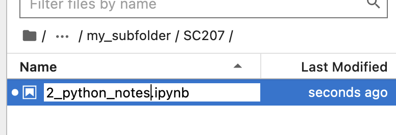
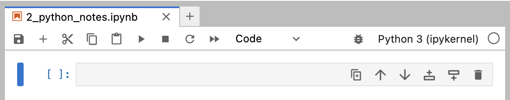

# Introduction to Jupyter Lab
## Navigating to your directory

Open the file browser

Navigate your way to the folder where you want to keep your notebooks. If you are using a Lab machine, this will ideally be a folder in your OneDrive cloud storage or on a USB stick.

If you open the wrong folder and need to go back a step, you can click on the appropriate folder to go back to on the file path displayed above the contents of your current folder.

If you need to create a new folder you can click the new directory button to the right of the blue + button.

Make sure your path ends with the directory you want to store your new notebook in.

## Creating a new Notebook
To create a new notebook click the blue + button

This will open the 'Launcher'. To create a new notebook click the Python icon under the heading `Notebook`

This will create an `Untitled.ipynb` file in your directory which you will see in the file browser on the left.

## Renaming your notebook
Your first action should be renaming your notebook to something more useful. Right click on `Untitled.ipynb` and select `Rename` from the menu.

We suggest renaming to reflect the session number and content, for example `2_python_notes.ipynb`

Make sure your file ends with `.ipynb` or Jupyter lab won't understand how to treat the file.

## Jupyter Menu Bar

*Note: Your interface may vary slightly depending on version*

The menu bar buttons, left to right are:
1. Save - Save the notebook
2. New cell - Create a new notebook cell below the currently selected cell.
3. Cut cells - Selected cells are cut ready to paste
4. Paste cells - Cut cells are pasted below the currently selected cell
5. Run cell - Runs the code in the currently selected cell
6. Stop cell - Press if you need to force the running code to stop.
7. Restart notebook - Resets the coding environment.
8. Restart and run all - Resets the notebook as above but then runs *all* cells in the notebook top to bottom.
9. Cell type selector - Switch the current cell between either a code or markdown (text) cell.

## Code and Markdown Cells
Notebook cells can be either `Code` or `Markdown` cells (ignore Raw).

Code cells interpret their contents as if it is Python code and running the cell executes the code.

Markdown cells interpret their contents as formatted text, and are useful for keeping notes and breaking up your code with explanatory text. Markdown cells use simple symbols to set text as headings, create bullet points, bold text etc. Once text has been written in a markdown cell it must be 'Run' like a code cell to see the formatting.

## Markdown Basics
Formatting text in markdown is fairly simple, and uses symbols to mark up how text should be formatted. Some common formatting options are shown below, but you can see more at [https://www.markdownguide.org/basic-syntax/](https://www.markdownguide.org/basic-syntax/).

> Even this guide was created using Markdown. [See for yourself](https://github.com/Minyall/sc207_2023-24/blob/main/jupyter_notes.md?plain=1)